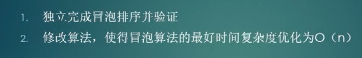

# 1、选择排序[包含优化算法，参考方式三]
SelectSortTest
对数器：
SelectSortTest.testCheckedData

# todo
特点：

# 2、冒泡排序
BubbleSortTestNew

# todo
特点：

最好的时间复杂度O(n) ，调整算法。
作业：

抽离方法。
最大的值最后沉底。

# 3、插入排序
InsertSortTest
# todo
特点：
从前往后遍历，遇到后面元素>前面元素，进行置换。

# 4、二分法查找
HalfSelectTest

# 计算题练习
# 1、计算数组 位置l～R的累加和。
两种方式：
1）、矩阵式，把每个位置的累加和都算好。n^2/2
2)、前缀和数组

# 2、计算机输出的随机数是等概率的，验证测试demo
RandomPercentageTest
# 3、1-5随机到1-7随机
这种1-5等概率随机，想扩容到1-7等概率随机，首先范围就比原（1，5）大，这种优先考虑
把原黑盒函数转为01发生器，然后基于目标1-7随机的诉求，往二进制上转【二进制每一位都是01，多个位可以表示多个数字，且都是等概率】

# 4、01不等概率随机 到01等概率随机
01不等概率，调用后输出情况：00，11，01，10.
假设0出现概率x，那么1出现概率 1-x
排除掉结果00和11，就只剩下结果01，10.概率是 x(1-x)
代码实现：出现00或11就回执函数，前后不同调用次数值保持不一致，即可实现01等概率随机。【不同调用次数出现在同一代码块】

# 5、对数器
# 数组长度和元素值都是随机的，测试时给个最大长度和元素最大值
CheckToolTest

# 6、练习二分法
有序数组中找到 =num 最左的位置

# 7、链表反转问题练习
单链表反转：SingleLinkTest 
双链表反转：DoubleLinkTest
队列和栈的练习【基于链表结构】:QueueAndStackByLinkedTest